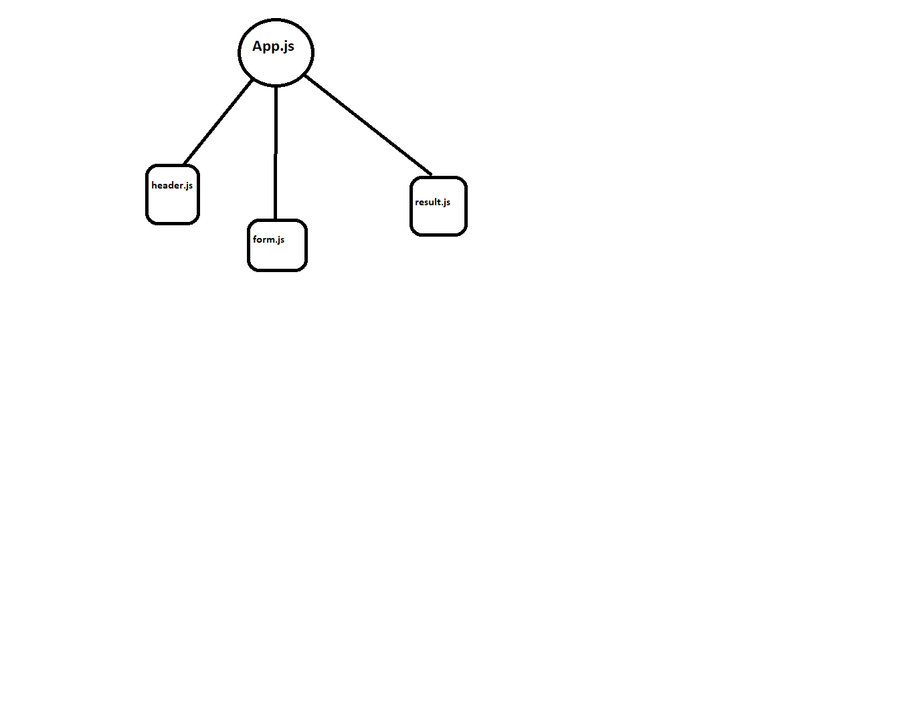

# resty

## Project: RESTy APP

### Author: Yazan Aljamal

### Links and Resources

- [submission PR base](https://github.com/yaljamal-401-advanced-javascript/resty-v2/pull/6)
- [deployed Application GH](https://yaljamal-401-advanced-javascript.github.io/resty-v2/)

### Modules

**`header.js`**
**`form.js`**
**`footer.js`**
**`result.js`**

#### Running the app

- `npm start`

#### Tests

- Unit Tests: `npm test` not done yet
- Lint Tests: `npm run lint`

#### UML

